# Architecture Diagrams

Visual reference for the KBL Compute Engine. All diagrams use [Mermaid](https://mermaid.js.org/); they render on GitHub and in most Markdown viewers.

See also: [architecture.md](architecture.md) (§ [Multiverse communication](architecture.md#multiverse-communication)), [provisioning-runtimes.md](provisioning-runtimes.md), [getting-started.md](getting-started.md).

---

## 0. README overview — multiple KBL fabrics

Compact banner used at the top of the root README. Multiple **Pluggable Universes** coordinate via **Multiverse routing + Kafka**; controllers never call each other directly.

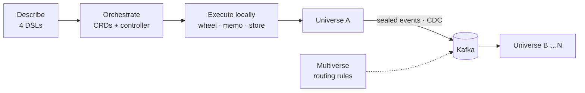

---

## 1. Four DSLs → Kubernetes

Blog meta-model mapped to this repository:

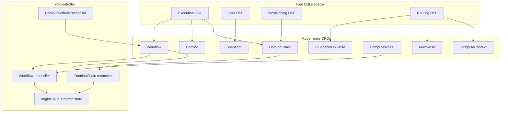

---

## 2. End-to-end domino execution

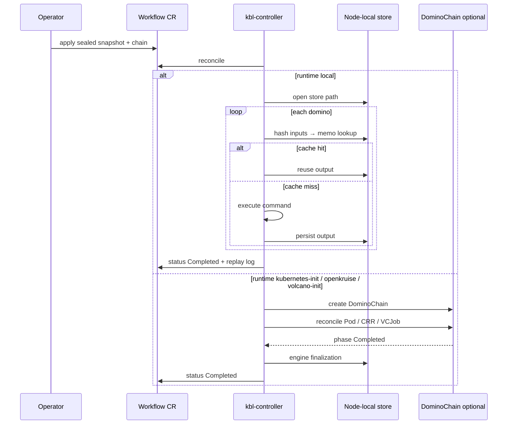

---

## 3. Compute Wheel (Ferris Wheel)

Time-slice rotation across contexts ([ADR 0006](adr/0006-compute-wheel-rotation.md)):

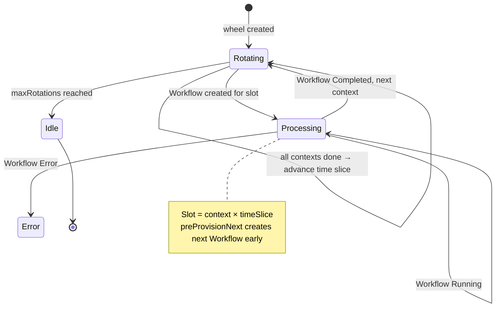

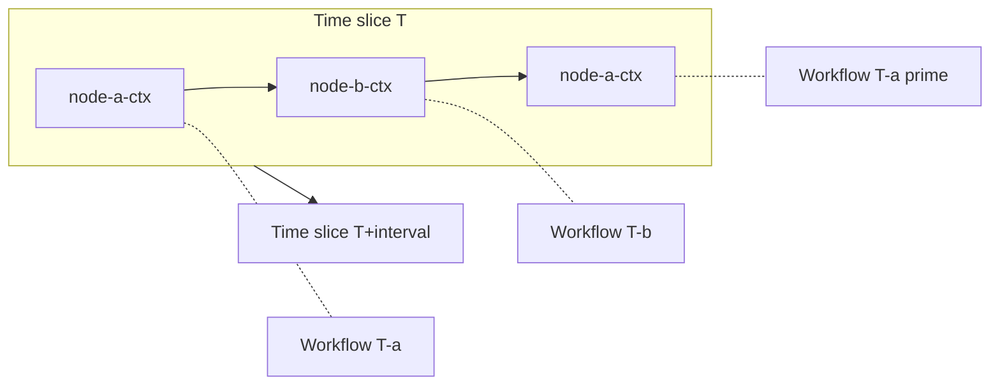

With Volcano (Phase 27), each stamped Workflow uses `runtime: volcano-init`:

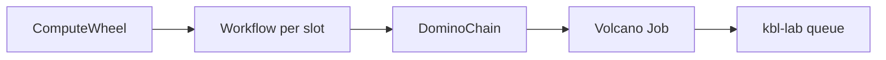

---

## 4. Kind lab topology

Three-node cluster after `make lab-up` ([ADR 0029](adr/0029-volcano-kind-lab.md)):

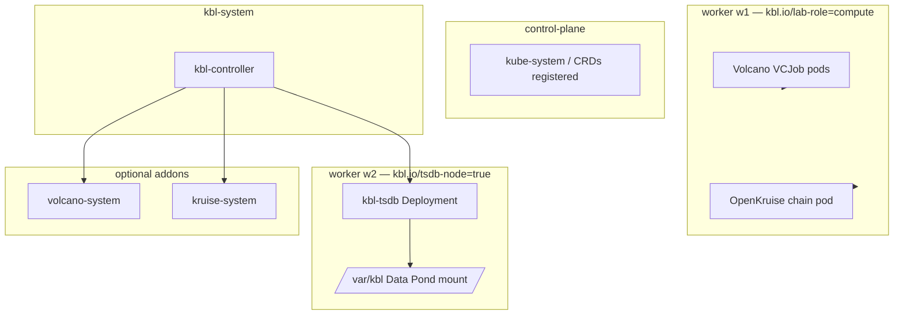

| Node | Labels | Workloads |
|------|--------|-----------|
| control-plane | `kbl.io/lab-role=control-plane` | Kubernetes system |
| worker w1 | `kbl.io/lab-role=compute` | VCJob task pods, OpenKruise domino pod |
| worker w2 | `kbl.io/tsdb-node=true` | TSDB, node-local `/var/kbl` |

---

## 5. Provisioning runtimes compared

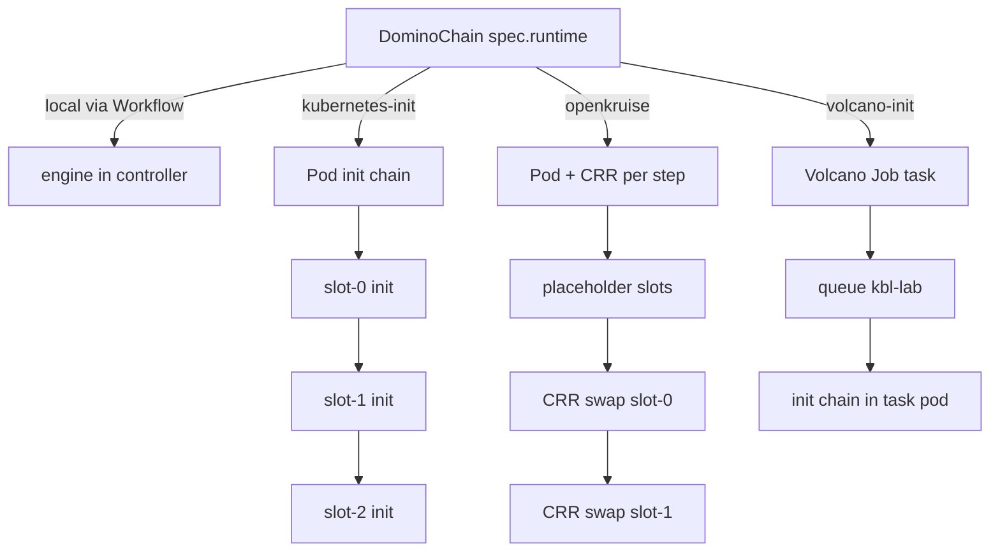

---

## 6. kubernetes-init pod anatomy

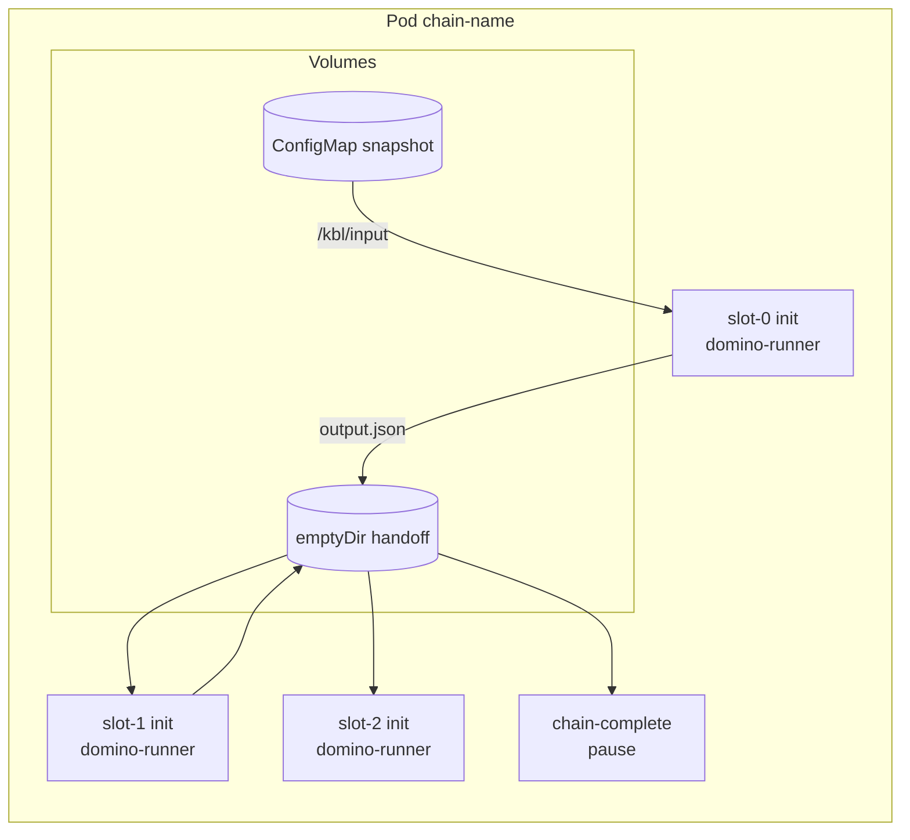

Environment per init container: `KBL_COMMAND`, `KBL_INPUT`, `KBL_OUTPUT`, optional `KBL_JULIA_*`.

---

## 7. OpenKruise hot-swap sequence

Player-piano pattern ([ADR 0007](adr/0007-hot-swapped-dominos-implementation.md), lab demo Phase 28):

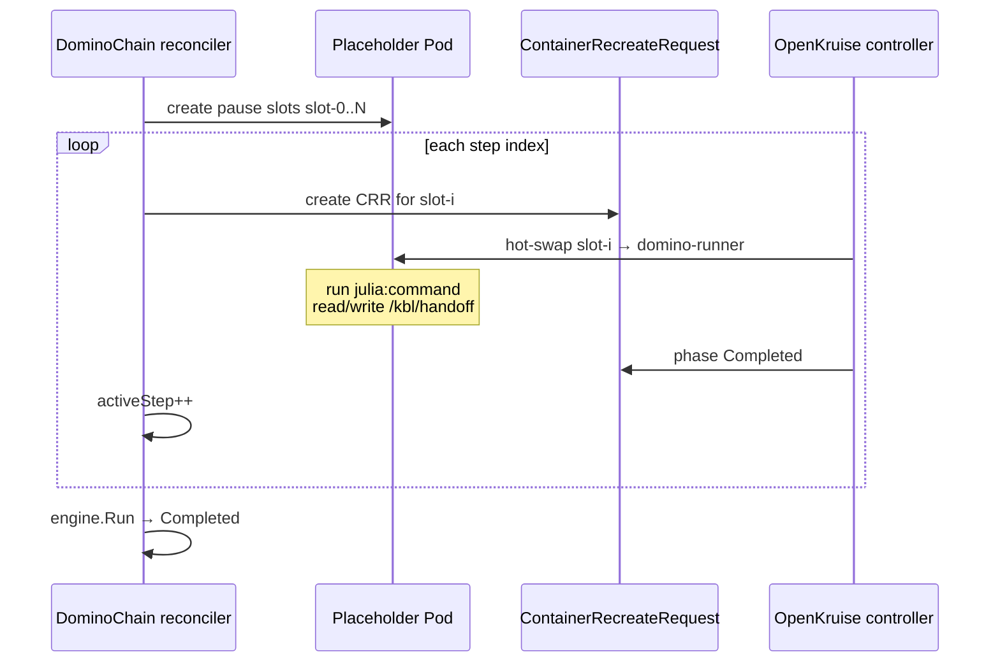

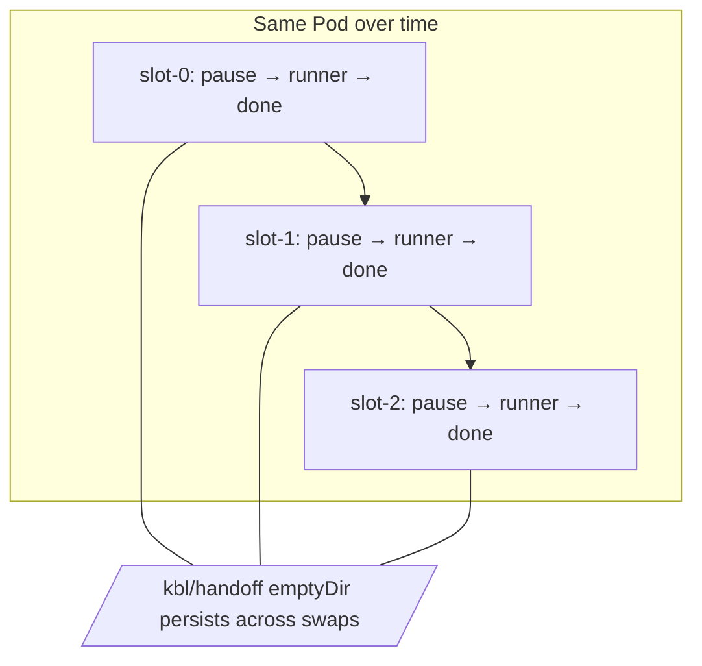

---

## 8. Volcano batch path (lab demo)

Full pipeline for `julia-finance-wheel`:

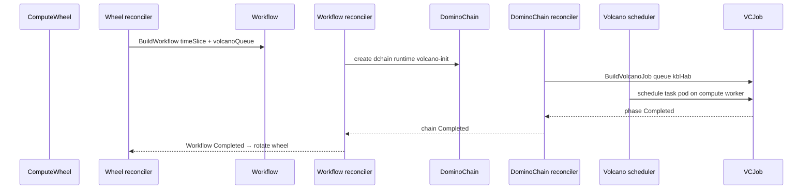

---

## 9. Julia finance chain (lab demos)

Same three dominos, three provisioning paths:

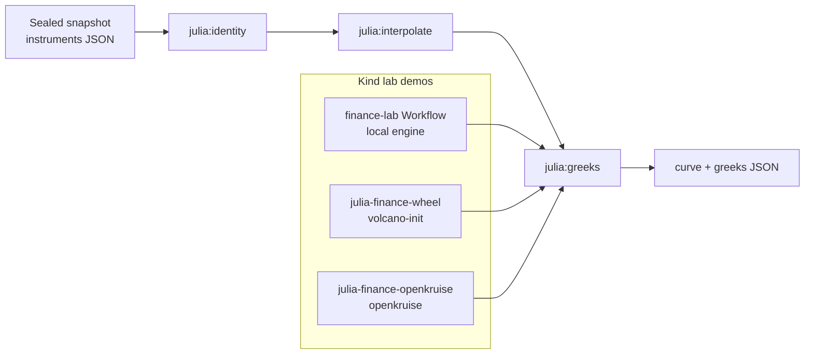

---

## 10. Memoization and replay

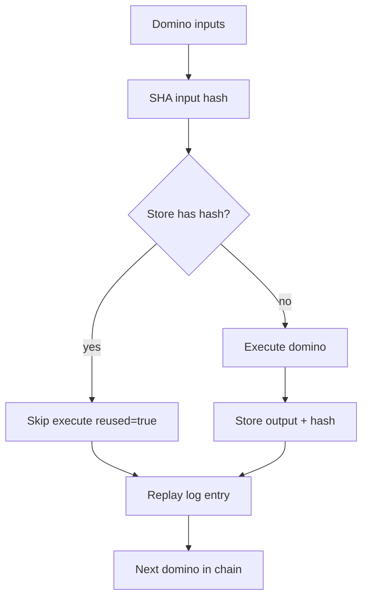

---

## 11. Multiverse routing — multiple KBL fabrics

Event-driven coordination across Pluggable Universes. Works in one cluster (MemoryBus or Kafka) or across clusters sharing a Kafka/MSK backbone. Controllers do **not** peer with each other — only events and replicated sealed results cross universes.

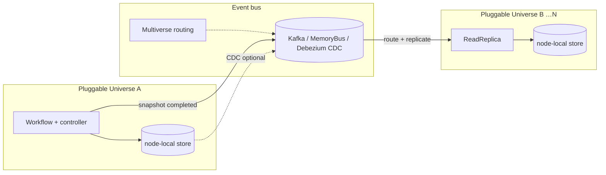

See [ADR 0009](adr/0009-multiverse-routing.md), [ADR 0011](adr/0011-read-replica-materialization.md), [ADR 0012](adr/0012-debezium-cdc-sync.md), and [architecture.md § Multiverse communication](architecture.md#multiverse-communication).

---

## 12. Kind lab troubleshooting

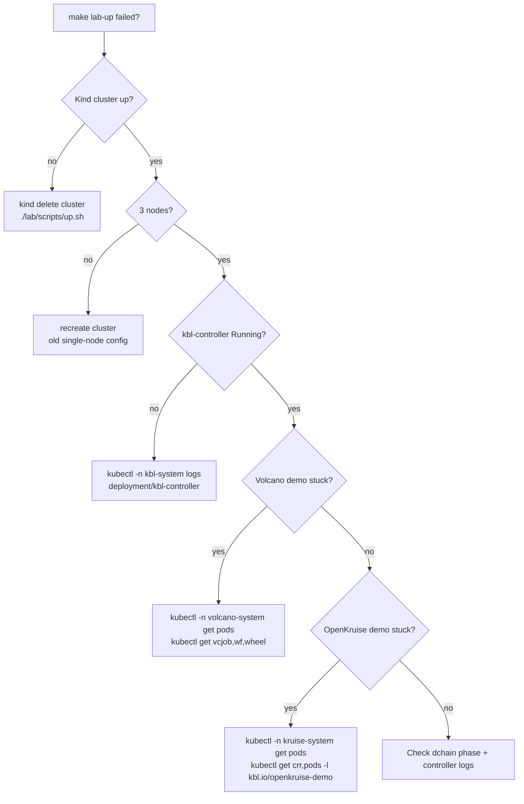

Common checks:

```bash
kubectl get nodes -L kbl.io/lab-role,kbl.io/tsdb-node
kubectl -n kbl-system get pods -o wide
kubectl get dchain,wf,wheel -A
kubectl -n kbl-system logs deployment/kbl-controller --tail=100
```

---

## 13. AWS target (CDK scaffold)

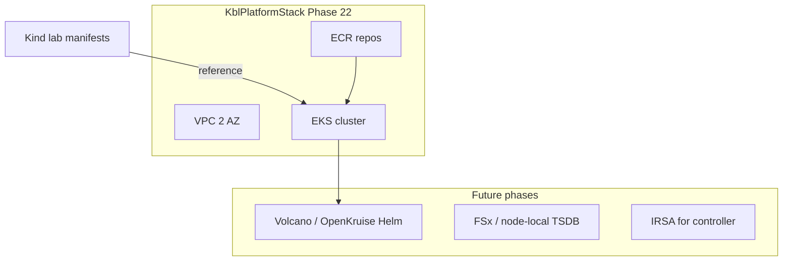

See [infra/aws/cdk/README.md](../infra/aws/cdk/README.md).
