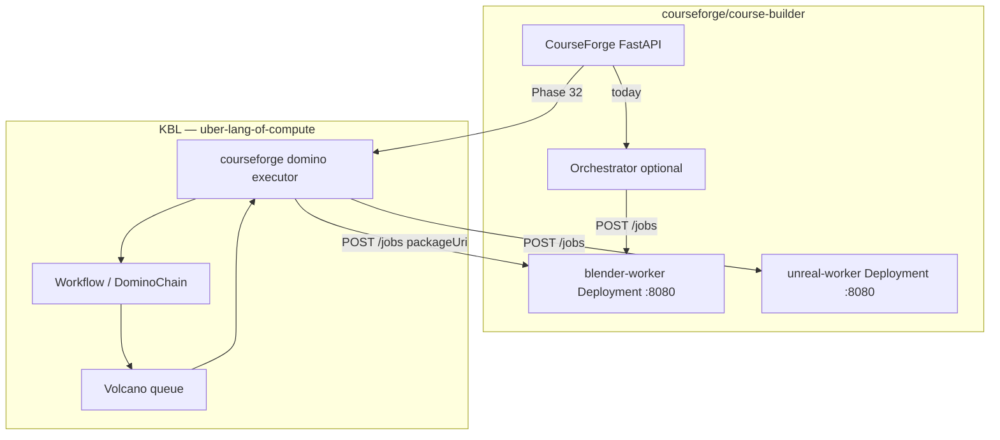

# Courseforge × KBL Compute Engine — Integration Exploration

**Status:** exploration (Phase 32 candidate)  
**Repos:** [`courseforge/course-builder`](https://github.com/courseforge/course-builder), [`courseforge/infrastructure`](https://github.com/courseforge/infrastructure), this repo.

## What Courseforge actually is (from `course-builder`)

This is **not** only legacy Google Course Builder external-task workers. The suite today is:

| Layer | Path in `course-builder` | Role |
|-------|-------------------------|------|
| **CourseForge API / UI** | `tools/courseforge/backend/`, `frontend/` | FastAPI balancer, LiDAR/course builds, tenant storage |
| **Orchestrator** | `tools/automation-workers/orchestrator/` | Postgres `course_jobs` / **stages** / artifacts; HTTP dispatch via `WorkerClient` |
| **Blender worker** | `tools/automation-workers/blender_worker/` | Long-lived pod/service `:8080`, runs **job packages** |
| **Unreal worker** | `tools/automation-workers/unreal_worker/` | Same HTTP contract, private UE engine image |
| **Job packages** | `tools/automation-workers/job-packages/builtin/` | Versioned `job.yaml` + scripts (zip/S3/file URI) — **logic changes without rebuilding heavy images** |
| **Kind skeleton** | `tools/automation-workers/k8s/` | `blender-worker` Deployment in `automation-workers` namespace |

Spec: [stable-worker-spec.md](https://github.com/courseforge/infrastructure/blob/main/docs/stable-worker-job-package-pattern/stable-worker-spec.md) (in `courseforge/infrastructure`).

### Worker HTTP contract (today)

Workers expose FastAPI on **port 8080**:

```http
POST /jobs
{
  "jobId": "...",
  "runtime": "blender",
  "packageUri": "file:///opt/worker/job-packages/builtin/blender-courseforge-build",
  "args": { "bundle_dir": "...", "blend_out": "..." }
}
GET /jobs/{id}  → state: preparing | running | succeeded | failed | ...
```

Orchestrator stages support **`dependsOn`** — topological sort in `orchestrator/stage_graph.py` (same idea as KBL domino `dependsOn`).

### Worker images (today)

| Image | Dockerfile | Notes |
|-------|------------|-------|
| `courseforge-blender-worker-base:22.04` | `blender_worker/Dockerfile.base` | Heavy: Ubuntu + Blender + FastAPI stack |
| `blender-worker` (thin) | `blender_worker/Dockerfile` | COPY `shared/`, `job-packages/`, harness |
| Unreal base | `scripts/build-unreal-linux-base-from-engine.sh` | Private ECR only |

Kind dev image: `localhost:5000/courseforge-blender-worker:dev` (`k8s/blender-worker-deployment.yaml`).

Backend dispatch example: `tools/courseforge/backend/lidar_worker_dispatch.py` → `POST` blender-worker with package `PACKAGE_LIDAR_PROCESS`.

## Why KBL fits as a *more sophisticated scheduler*

Courseforge already separates **stable worker images** from **versioned job packages**. KBL adds Kubernetes-native scheduling and audit semantics the orchestrator does not have today:

| Courseforge today | KBL adds |
|-------------------|----------|
| Orchestrator HTTP dispatch to fixed worker URLs | **Volcano queues** — fair share per course/cohort/GPU pool |
| Stage graph in Postgres | **Workflow / DominoChain** CRs + reconciler (same DAG semantics) |
| Poll worker job state | **Replay log** + snapshot IDs for audit/regrade |
| Re-run identical build | **Memoization** on input hash |
| Single Kind worker replica | **ComputeWheel** time slices (module/week rotation) |
| `automation-workers` namespace | **Multiverse** — route tenants/universes (future) |
| EKS scale-out (roadmap) | Same patterns on home i9 Kind + Volcano (Phase 31) |

KBL **does not replace** CourseForge UI, Postgres job store, MinIO/S3 artifacts, or the **heavy worker images**. It can **upgrade the dispatch/scheduling plane** above those stable runtimes.

## Architecture options



### Option A — KBL domino calls existing worker Services (recommended PoC)

Keep **long-lived** `blender-worker` / `unreal-worker` Deployments. Add a KBL domino command, e.g. `courseforge:package`:

1. Read sealed snapshot + args from `KBL_INPUT` (packageUri, runtime, args).
2. `POST http://blender-worker.automation-workers.svc:8080/jobs`.
3. Poll until `succeeded` / `failed`.
4. Write artifact refs + logs to `KBL_OUTPUT`.

**Volcano** schedules the **domino-runner pod** that performs the HTTP orchestration (lightweight). Heavy Blender/Unreal images stay as today.

Map:

| KBL | Courseforge |
|-----|-------------|
| `PluggableUniverse` `runtime: blender` | Worker Service URL + base image tag for docs/RBAC |
| One domino step | One orchestrator **stage** / one `POST /jobs` |
| `DominoChain.spec` chain + `dependsOn` | Orchestrator `stages[]` + `dependsOn` |
| `volcanoQueue: course-<id>` | Per-course fair share |

### Option B — KBL replaces orchestrator dispatch only

CourseForge API creates **Workflow** CRs instead of Postgres `course_jobs`. KBL reconciler expands stages → domino chain → Option A HTTP calls. Postgres becomes optional for status (read from Workflow status).

### Option C — Run job package inside domino-runner image (later)

Embed package runner from `shared/job_package/` in `kbl-domino-runner-courseforge` so Volcano schedules **one-shot pods** with the heavy Blender base image. Higher isolation, colder starts — matches KBL init-chain model but **conflicts** with “stable long-lived worker” design unless used for burst GPU jobs only.

## Concrete repo map for Phase 32

| Step | Where |
|------|--------|
| Inventory images | `tools/automation-workers/blender_worker/Dockerfile*`, `docker-compose.yml` |
| Worker API | `shared/worker_harness.py`, `blender_worker/main.py` |
| Stage DAG | `orchestrator/stage_graph.py`, `orchestrator/workflow.py` |
| Backend → worker | `tools/courseforge/backend/lidar_worker_dispatch.py` |
| Kind co-install | `courseforge/infrastructure` Kind installer + KBL `lab/HOME-LAB.md` profile |
| KBL shim | New `controller/pkg/executor/courseforge/` + `kbl-domino-runner-courseforge` (thin) |
| Volcano demo | Queue `courseforge-lab`; Workflow with `courseforge:package` domino |

## Open questions

1. Should orchestrator **remain** for Postgres/artifacts while KBL owns scheduling, or migrate status to CRDs only?
2. GPU Unreal workers on i9 — Volcano `nvidia.com/gpu` + existing UE ECR image?
3. Job package URIs (S3/MinIO) — seal as **Snapshot** in KBL store before dispatch?
4. Tekton in infrastructure — build worker images; KBL `PluggableUniverse.runtimeImage` pins the same ECR tag?

## References

- [ADR 0036](../adr/0036-courseforge-integration-exploration.md)
- [lab/HOME-LAB.md](../../lab/HOME-LAB.md)
- `course-builder/tools/automation-workers/README.md`
- `courseforge/infrastructure/docs/stable-worker-job-package-pattern/stable-worker-spec.md`
