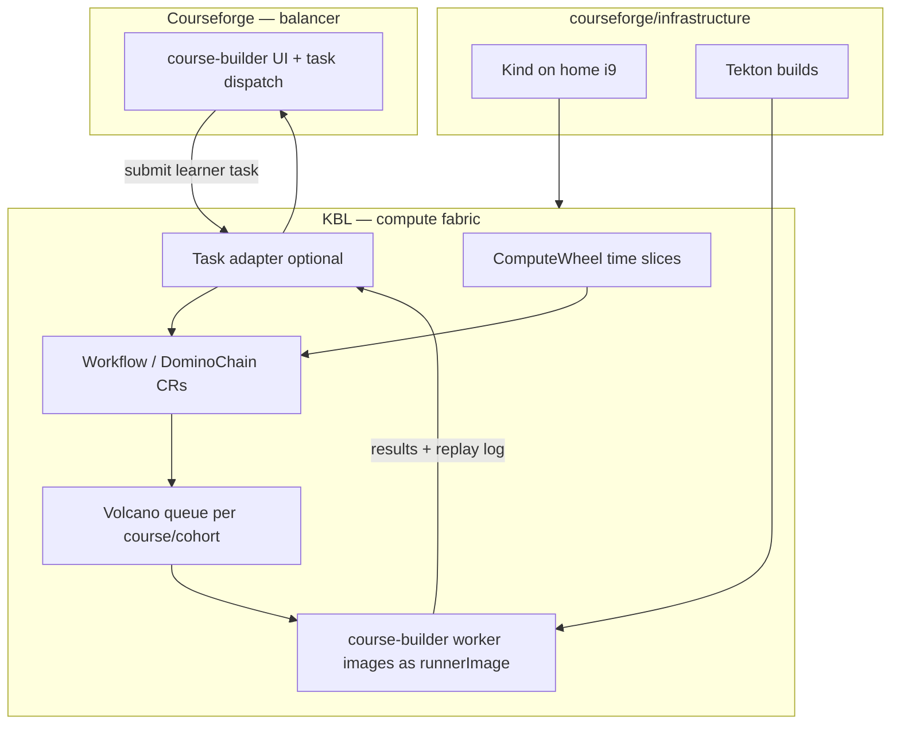

# Courseforge × KBL Compute Engine — Integration Exploration

**Status:** exploration (Phase 32 candidate)  
**Suite context:** [Courseforge handbook](https://courseforge.github.io/docs/handbook/repositories/) — repos under **`courseforge/`** org (private).

## Why this pairing makes sense

**Courseforge** ([`courseforge/course-builder`](https://github.com/courseforge/course-builder)) follows the classic **Course Builder** pattern:

| Layer | Role |
|-------|------|
| **Balancer** | Course UI + task dispatch (the main application) |
| **Worker pool** | Builds and runs learner code; returns results |

**KBL** ([uber-lang-of-compute](../README.md)) is already a **Kubernetes-native compute fabric** with a richer scheduling stack than a flat worker URL:

- **Volcano** — batch queues, gang scheduling, fair share (lab Phase 25–31)
- **ComputeWheel** — time-slice rotation (weekly modules, lab sessions)
- **PluggableUniverse** — swappable runtimes via **`runtimeImage`**
- **DominoChain + domino-runner** — containerized execution with snapshot handoff
- **Multiverse + Kafka** — multi-tenant / multi-course routing
- **Snapshots + memoization** — immutable inputs, skip duplicate runs (useful for identical submissions)

KBL does **not** replace the Courseforge **balancer** (UI, auth, course content). It can **replace or sit behind the worker pool** as a more sophisticated **compute scheduler**.

## Suite map

From the [documentation-generator suite handbook](https://github.com/jmjava/documentation-generator/blob/main/docs/suite/repositories.markdown):

| Repository | Integration touchpoint |
|------------|------------------------|
| **`courseforge/course-builder`** | Balancer; **worker images**; external-task API → KBL adapter |
| **`courseforge/infrastructure`** | Kind lab on home i9; Tekton; could host **kbl-controller** + Volcano alongside existing installer |
| **`jmjava/tekton-dag`** | Build worker images; optional pipeline to publish images KBL consumes |
| **`jmjava/uber-lang-of-compute`** (this repo) | Scheduler fabric: controller, Volcano, Multiverse |
| **`jmjava/documentation-generator`** | Docgen / demo videos for integrated stack |

## Worker images — how they plug in

Today KBL runs dominos via **`domino-runner`** images (`kbl-domino-runner`, `kbl-domino-runner-julia`) with a small contract:

| Env var | Purpose |
|---------|---------|
| `KBL_COMMAND` | e.g. `builtin:identity`, `julia:greeks` |
| `KBL_INPUT` | Path to input JSON (sealed snapshot + prior domino outputs) |
| `KBL_OUTPUT` | Path to write output JSON |

**Courseforge worker images** (in `course-builder`) likely speak a **different HTTP or process contract** (Google’s [external task balancer](https://github.com/google/coursebuilder-android-container-module) model: POST code → build → run → screenshot/result).

### Integration options (in increasing invasiveness)

| Option | Description | When to use |
|--------|-------------|-------------|
| **A. Image alias** | Point `PluggableUniverse.spec.executionEngine.runtimeImage` / `DominoChain.spec.runnerImage` at an **existing course-builder worker image** if it already implements the KBL handoff (or a thin wrapper entrypoint). | Worker Dockerfile adds `KBL_*` shim only |
| **B. domino-runner shim** | New image `kbl-domino-runner-courseforge` that wraps course-builder worker: reads `KBL_INPUT`, calls worker API, writes `KBL_OUTPUT`. | Preserve course-builder worker logic unchanged |
| **C. Domino = one learner run** | Single domino step `courseforge:run` per submission; chain length 1; Volcano still schedules the pod. | Minimal CR surface |
| **D. Full chain** | Compile → test → grade as **multi-step DominoChain** (init or OpenKruise); each step can use a **different worker image** from course-builder. | Rich labs (build, run, validate) |

**Recommended first PoC:** **Option B or C** — one PluggableUniverse per language/runtime image you already maintain in course-builder, scheduled through **`runtime: volcano-init`** and queue **`course-<id>`**.

## KBL as “more sophisticated scheduler”

What Courseforge gains over a single worker URL:

| Capability | KBL mechanism | Courseforge benefit |
|------------|---------------|---------------------|
| **Fair share across sections** | Volcano `Queue` per course (`capability`, `weight`) | CS101 lab doesn’t starve CS201 |
| **Session / week rotation** | `ComputeWheel` time slices | Align compute with module releases |
| **Runtime isolation** | `PluggableUniverse` + separate worker images | Python vs Java vs GPU labs |
| **GPU workers (4080 home lab)** | `nodeSelector: kbl.io/gpu=present` + Volcano GPU tasks | Heavy ML assignments on i9 box |
| **Audit / regrade** | Replay log + snapshot IDs | Deterministic “why this grade?” |
| **Duplicate submission dedup** | Memoization on input hash | Same code twice → reuse result |
| **Multi-campus / multi-tenant** | Multiverse routing + Kafka | Separate universes per org (future) |

Volcano is the closest analog to a **course-aware batch scheduler**; the ComputeWheel adds **temporal structure** Course Builder never had natively.

## Proposed phases

### Phase 32a — Inventory (courseforge/course-builder)

- [ ] List worker Dockerfiles / image names and tags
- [ ] Document worker HTTP/API contract (request/response)
- [ ] Map each image → `executionEngine.type` + `runtimeImage`
- [ ] Note GPU vs CPU worker variants

*Requires read access to **`courseforge/course-builder`** (private org).*

### Phase 32b — Kind co-install (courseforge/infrastructure + KBL)

- [ ] Extend home i9 Kind profile to deploy **kbl-controller + Volcano** next to existing suite services
- [ ] Publish course-builder worker images into Kind (`kind load docker-image`)
- [ ] Single manual Workflow using `runnerImage: <course-builder-worker>`

### Phase 32c — Adapter (balancer → KBL)

- [ ] Service or module in course-builder: external task → create `Workflow` / `DominoChain`
- [ ] Poll `status.phase` + replay log → balancer task result
- [ ] Optional: webhook from controller on completion

### Phase 32d — Production-shaped demo

- [ ] Volcano queue **`courseforge-lab`**
- [ ] ComputeWheel for a **two-week module** (two contexts / time slices)
- [ ] `verify-volcano.sh`-style script for course operators

## Open questions (need course-builder repo)

1. **Exact repo path** for worker images (`docker/`, `workers/`, `modules/...`)?
2. Does the balancer use **Google’s `gcb_external_task_balancer_*`** settings or a custom REST API?
3. Are workers **long-lived** (pool) or **one-shot** containers per submission? (KBL favors one-shot domino pods; long-lived pools map to PluggableUniverse + many Workflow CRs.)
4. Should **grading** be a second domino in the chain or part of the worker image?
5. **Tekton** — build worker images in CI, push to registry KBL `PluggableUniverse` references?

## References

- [ADR 0036: Courseforge integration exploration](../adr/0036-courseforge-integration-exploration.md)
- [ADR 0031: ComputeWheel Volcano queue](../adr/0031-computewheel-volcano-queue.md)
- [lab/HOME-LAB.md](../../lab/HOME-LAB.md) — i9 / Volcano home profile
- [Courseforge suite repositories (handbook)](https://courseforge.github.io/docs/handbook/repositories/)
- [Google Course Builder external task module](https://github.com/google/coursebuilder-android-container-module) — balancer/worker reference architecture
