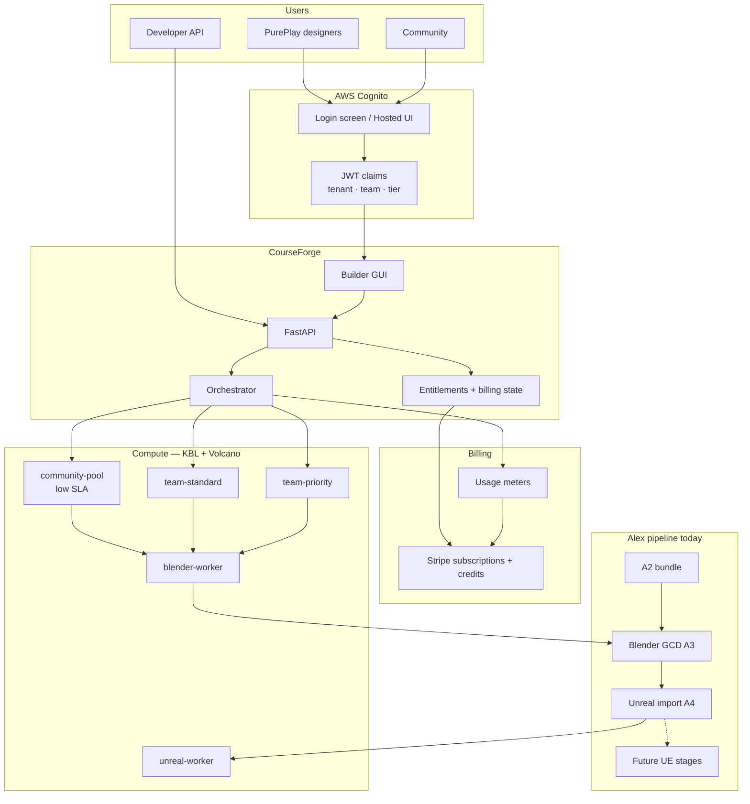
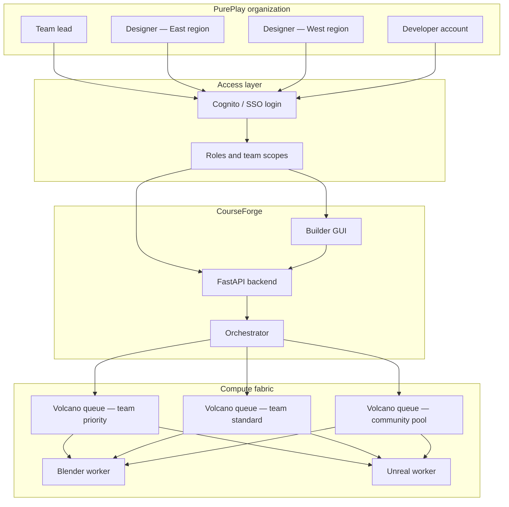
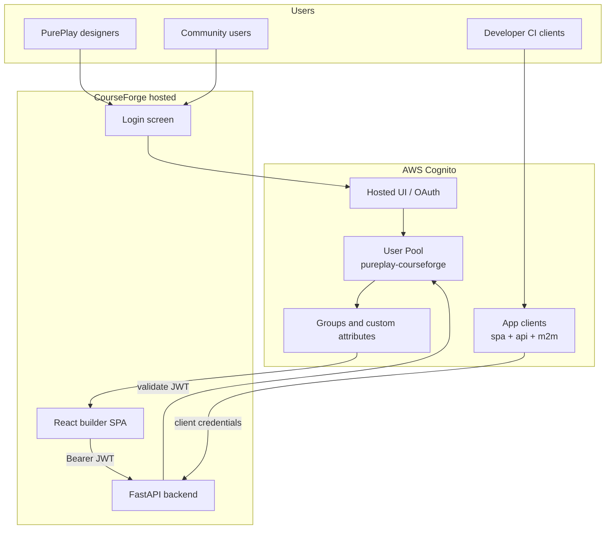
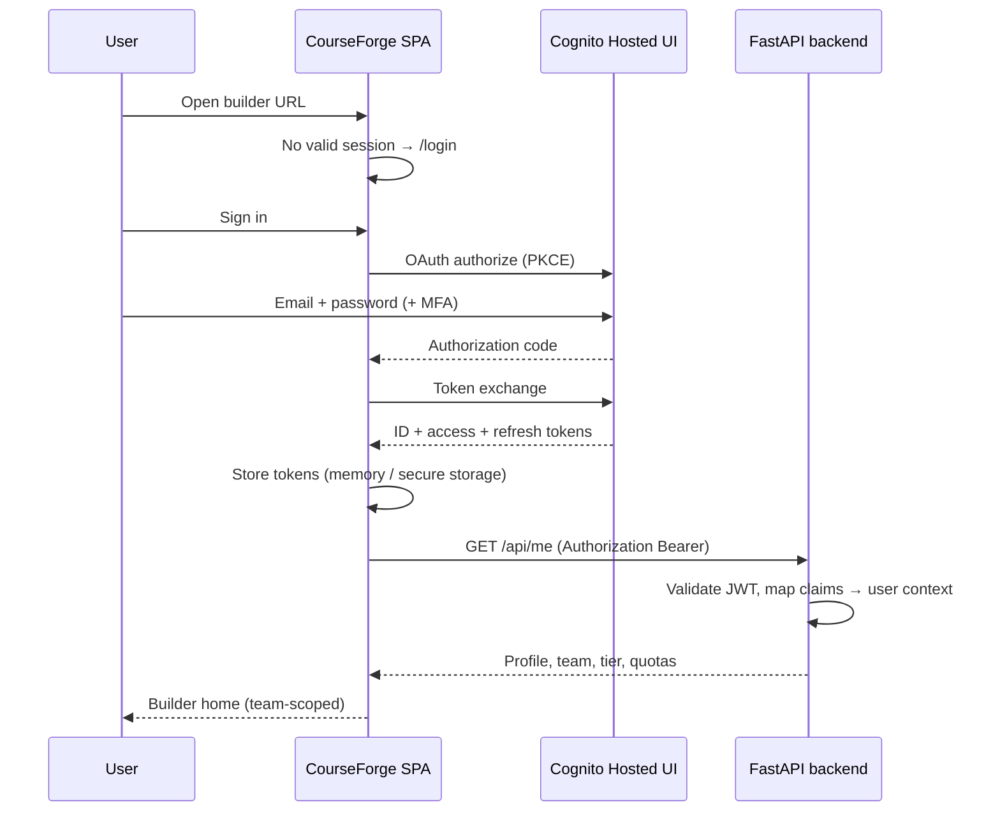
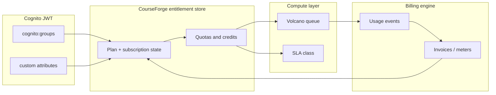
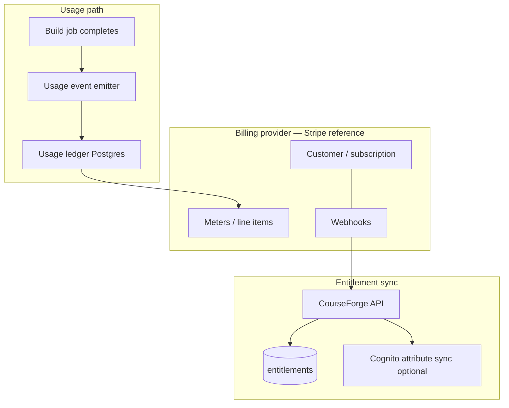
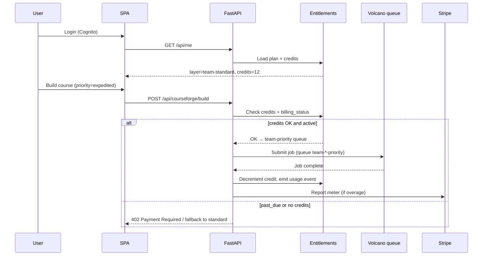
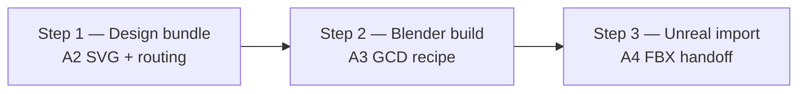
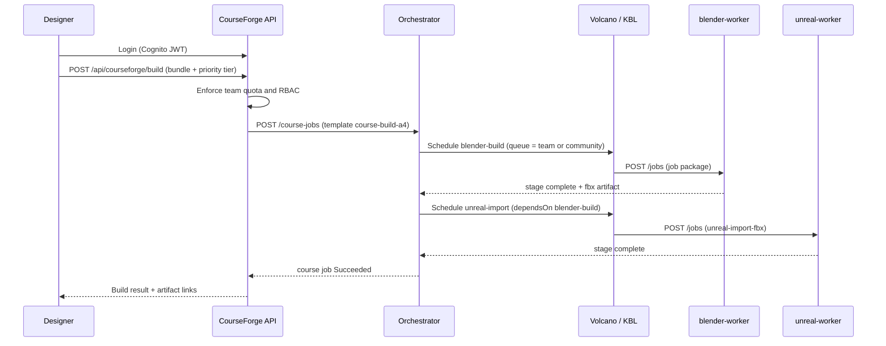

# PurePlay × CourseForge — Multi-Tier Builder Platform Use Case

**Status:** target use case (production vision) — **ready for Alex + PurePlay review**  
**Target customer:** **PurePlay**  
**Audience:** Alex (Blender/Unreal pipeline), PurePlay product/ops, CourseForge platform  
**Related:** [Courseforge × KBL integration](courseforge-integration.md) · [ADR 0036](../adr/0036-courseforge-integration-exploration.md)

### Share link (after merge)

GitHub: `docs/explorations/pureplay-multi-tier-platform.md` in [jmjava/uber-lang-of-compute](https://github.com/jmjava/uber-lang-of-compute)  
Open PR for review: [#35](https://github.com/jmjava/uber-lang-of-compute/pull/35)

Mermaid diagrams render on GitHub and in VS Code/Cursor preview — suitable for pasting into PurePlay meetings or exporting via [Mermaid Live Editor](https://mermaid.live).

### Diagram index (9 figures)

| # | Section | What it shows |
|---|---------|---------------|
| 1 | [Platform overview](#platform-overview-for-review) | End-to-end: login → tiers → billing → 3-step build |
| 2 | [Actors and teams](#actors-and-teams) | PurePlay org, Cognito, CourseForge, Volcano queues |
| 3 | [Cognito resources](#cognito-resources-pureplay-production) | User Pool, Hosted UI, app clients |
| 4 | [Login flow](#login-screen--user-experience) | Hosted UI PKCE sequence |
| 5 | [Service layer mapping](#cognito--service-layer-mapping) | Identity → entitlements → queues → billing |
| 6 | [Billing architecture](#billing-architecture) | Usage events, Stripe, webhooks |
| 7 | [Billing submit flow](#billing--cognito--scheduler-flow) | Credits check before priority queue |
| 8 | [Build pipeline](#current-course-build-pipeline-three-steps) | A2 → Blender A3 → Unreal A4 (+ Alex future stages) |

### Platform overview (for review)

Single-page view for Alex and PurePlay stakeholders:



**Key points for PurePlay**

- One GUI; **Cognito login** gates hosted access; teams isolated by tenant + team id.
- **Four service layers**: community (free, long waits OK), team standard, team priority (credits), developer pro.
- **Billing** meters builds and priority credits; payment status controls expedited queue access.
- **Today’s build**: design bundle → Blender (Alex GCD) → Unreal FBX import; Alex adds more Unreal stages later without rebuilding worker images.

---

## Summary

PurePlay course designers use **CourseForge builder tools** to turn design bundles into playable golf courses. Access is gated by **login and team membership**. Compute runs on a shared **Blender + Unreal worker pool** scheduled by the CourseForge orchestrator and, in hosted mode, **KBL + Volcano** for queue-aware batch scheduling.

The platform serves three overlapping audiences:

| Audience | What they need | Service expectation |
|----------|----------------|---------------------|
| **PurePlay design teams** | Reliable builds during working sessions | Predictable turnaround; optional **speed priority** |
| **Developer accounts** | API keys, CI hooks, custom integrations | Tiered quotas; burst or dedicated capacity |
| **Community pool** | Broader access to builder tools for learning and experimentation | **Low SLA** — long queue waits acceptable |

One React GUI and one FastAPI backend ([MILESTONE-A6](https://github.com/courseforge/course-builder/blob/main/milestones/specs/MILESTONE-A6.md)) serve all modes; differences are **identity, tenant policy, and compute queue tier** — not separate products.

---

## Actors and teams



### Team model

| Concept | Meaning for PurePlay |
|---------|---------------------|
| **Organization tenant** | `PurePlay` — top-level billing, data segregation, org-wide policy |
| **Design team** | e.g. `pureplay-east`, `pureplay-prototype` — shared artifact prefix, shared quota pool |
| **Team lead** | Manages members, approves community publication, can purchase priority credits |
| **Designer** | Submits builds, views team artifacts; cannot cross team boundaries |
| **Developer account** | Machine identity (API key / OAuth client) for automation; separate quota and SLA tier |

Team membership is enforced at the API ([MILESTONE-15](https://github.com/courseforge/course-builder/blob/main/milestones/specs/MILESTONE-15.md) tenancy model): every job, artifact URI, and orchestrator `courseId` carries a **tenant id** and **team id** partition key.

---

## Identity: login screen and user management (AWS Cognito)

PurePlay hosted builder access requires a **login screen**, **session management**, and **user administration** before designers reach the CourseForge GUI. **AWS Cognito** is the reference identity provider — aligned with CourseForge [MILESTONE-15](https://github.com/courseforge/course-builder/blob/main/milestones/specs/MILESTONE-15.md) and the platform default for hosted/subscription operation.

### Why Cognito

| Requirement | Cognito feature |
|-------------|-----------------|
| Login screen for browser users | **Hosted UI** or **Amplify Auth** embedded in the React SPA |
| PurePlay org + team membership | **User Pool groups** + **custom attributes** (`custom:tenant_id`, `custom:team_id`) |
| Community vs internal users | Separate groups (`community`, `designer`, `team-lead`, `developer`) |
| Developer / CI accounts | **App client** with client credentials or machine-to-machine flow |
| Future enterprise SSO | **SAML / OIDC federation** into the same User Pool |
| API authorization | **JWT access tokens** validated by FastAPI on every request |

Local desktop (Tauri) and `run.sh` dev mode remain **unauthenticated or license-gated**; Cognito applies to **hosted cloud** and **community Kind** deployments where multi-tenant policy is enforced.

### Cognito resources (PurePlay production)



| Resource | Purpose |
|----------|---------|
| **User Pool** | `pureplay-courseforge` (or shared CourseForge pool with tenant attribute) |
| **App client — SPA** | Public client with PKCE for `tools/courseforge/frontend` |
| **App client — API** | Optional confidential client for server-side token exchange |
| **App client — M2M** | Developer accounts; client id + secret → access token with `developer` scope |
| **Hosted UI domain** | `auth.build.pureplay.example.com` — branded login, signup, forgot password |
| **Custom attributes** | `tenant_id`, `team_id`, `service_tier` (mutable by admins only) |
| **Groups** | `pureplay-designer`, `pureplay-team-lead`, `pureplay-developer`, `community` |

Optional **Cognito Identity Pool** if the SPA needs direct AWS credentials (e.g. short-lived S3 upload from browser). Prefer **presigned URLs from the API** when possible so the backend remains the tenancy gatekeeper.

### Login screen — user experience

The builder SPA shows a **dedicated login route** (`/login`) before any build tools load. Unauthenticated users are redirected; expired sessions show a re-login prompt with return URL preserved.

**Phase 1 (fastest): Cognito Hosted UI**

- Redirect to Cognito Hosted UI (PurePlay logo, colors via CSS customization).
- Supports email/password, MFA (optional TOTP), forgot password, email verification.
- On success, redirect back to SPA with authorization code; SPA exchanges for tokens (PKCE).
- **Pros:** no custom auth UI to maintain; MFA and compliance features built in.
- **Cons:** leaves CourseForge domain briefly during login.

**Phase 2 (optional): Embedded login in SPA**

- **Amplify Auth** or **oidc-client-ts** renders login form inside CourseForge chrome.
- Same User Pool; better brand continuity for PurePlay.
- Hosted UI remains fallback for password reset and MFA enrollment.



**Session behavior**

- Access token TTL: 1 hour (typical); refresh token: 30 days with rotation.
- SPA refreshes silently before expiry; on refresh failure → `/login`.
- Logout: revoke refresh token + clear local storage + Cognito global sign-out (optional).

### User management

User lifecycle spans **Cognito (identity)** and **CourseForge backend (authorization + quotas)**. Cognito owns credentials; the API owns team membership, entitlements, and audit.

| Action | Who performs it | Where |
|--------|-----------------|-------|
| Create PurePlay designer | Team lead or org admin | Admin UI → API → `AdminCreateUser` / invite email |
| Invite to team | Team lead | API updates `custom:team_id` + group membership |
| Remove from team | Team lead | API removes group; may disable Cognito user if leaving org |
| Community self-signup | End user | Hosted UI signup → auto `community` group + `tenant_id=community` |
| Promote to team lead | Org admin | API + Cognito group change |
| Developer API client | Org admin | Create M2M app client; map to service principal in API DB |
| Reset password / MFA | User | Hosted UI self-service |
| Disable account | Org admin | Cognito `AdminDisableUser` + API mark inactive |

**Admin surfaces (hosted GUI)**

1. **Org admin** (PurePlay IT) — list users, assign teams, set service tier, view usage.
2. **Team lead** — invite/remove designers on their team; cannot see other teams’ artifacts.
3. **Self-service profile** — name, password, MFA; read-only team and tier display.

The React SPA adds an **Account** / **Team settings** panel (M15 “hosted GUI policy surfaces”): show remaining quota, priority credits, and queue tier before submit.

**Provisioning flow — new PurePlay designer**

1. Team lead enters email in **Invite member** form.
2. API calls Cognito `AdminCreateUser` (invite message) with `custom:tenant_id=pureplay`, `custom:team_id=pureplay-east`.
3. API adds user to group `pureplay-designer`.
4. API inserts row in tenant DB (user id = `sub`, team, default tier `team-standard`).
5. User clicks invite link → sets password on Hosted UI → lands in builder.

**Community signup**

1. User opens community portal (`community.build.pureplay.example.com`).
2. Hosted UI **Sign up** enabled for this app client only.
3. Post-confirmation Lambda (or API webhook) assigns `community` group and `service_tier=community-pool`.
4. No team lead approval required; optional email domain blocklist for abuse.

### JWT claims and API enforcement

Every authenticated API call carries a **Bearer access token**. FastAPI middleware validates signature (Cognito JWKS), issuer, audience, and expiry, then builds request context:

| Claim | Maps to |
|-------|---------|
| `sub` | User id (stable) |
| `email` | Display + audit |
| `custom:tenant_id` | Storage partition (`pureplay`, `community`) |
| `custom:team_id` | Team RBAC + Volcano queue selection |
| `custom:service_tier` | `community-pool`, `team-standard`, `team-priority`, `developer-pro` |
| `cognito:groups` | Role checks (`team-lead` may invite) |

**Fail closed:** missing `tenant_id`, unknown team, or group/endpoint mismatch → `403` with no partial data leak. Job submit, artifact download, and trace endpoints all re-check tenant ([M15 segregation enforcement points](https://github.com/courseforge/course-builder/blob/main/milestones/specs/MILESTONE-15.md)).

Developer M2M tokens use a **service principal** record linked to an app client id; claims include `client_id` and scoped `tenant_id` / `team_id` — no human `email`.

### Developer accounts (separate from human login)

Developer accounts do not use the login screen. They authenticate with **client credentials**:

```http
POST https://auth.build.pureplay.example.com/oauth2/token
Content-Type: application/x-www-form-urlencoded

grant_type=client_credentials&client_id=...&client_secret=...&scope=build:submit build:read
```

The API maps the client to a **developer-pro** tier queue and webhook configuration. Org admins rotate secrets via admin UI; old secrets revoked in Cognito.

### PurePlay + community on one pool vs split pools

| Approach | When to use |
|----------|-------------|
| **Single User Pool**, tenant attribute distinguishes PurePlay vs community | Recommended start — one Hosted UI, simpler ops |
| **Separate User Pools** | Hard regulatory isolation between PurePlay employees and public community |

PurePlay production likely starts with **one pool** and group-based separation; split only if compliance requires it.

### Implementation checklist (CourseForge + infrastructure)

- [ ] Cognito User Pool + SPA app client (PKCE) in `courseforge/infrastructure` CDK/Terraform
- [ ] Hosted UI branding (PurePlay logo, callback URLs for staging + prod)
- [ ] Custom attributes and groups defined in IaC
- [ ] FastAPI JWT middleware + `/api/me`, `/api/admin/users`, `/api/teams/{id}/members`
- [ ] React `/login` route, auth guard on builder routes, token refresh
- [ ] Post-confirmation trigger for community tier assignment
- [ ] M2M app client for developer pro tier
- [ ] Audit log: actor `sub`, tenant, team, action ([M15 baseline](https://github.com/courseforge/course-builder/blob/main/milestones/specs/MILESTONE-15.md))
- [ ] Entitlement store + `/api/me` merge with billing status
- [ ] Stripe (or stub) webhooks → plan / `past_due` sync

Local dev bypass: `AUTH_MODE=none` or static dev JWT — never enabled in hosted environments.

---

## Login and access to builder tools (summary)

Hosted PurePlay deployments gate the builder through **Cognito** (see previous section). Claims drive team isolation and queue tier:

| Claim / field | Use |
|---------------|-----|
| `sub` | Stable user id |
| `custom:tenant_id` | PurePlay org partition |
| `custom:team_id` | Design team for RBAC and artifact paths |
| `custom:service_tier` | Maps to Volcano queue / SLA tier |
| `cognito:groups` | Roles: `designer`, `team-lead`, `developer`, `community` |
| Scopes | API actions: `build:submit`, `build:read`, `artifact:download`, `dev:webhook` |

**Login surfaces:**

1. **Browser (hosted cloud / community Kind)** — Login screen → Cognito Hosted UI (or embedded Amplify) → CourseForge SPA.
2. **Pro desktop (optional)** — Tauri shell with CF1/CFS1 license gate for offline-capable local Blender; Cognito when online for cloud Unreal builds.
3. **Developer accounts** — OAuth2 client credentials; no interactive login screen.

Authorization **fails closed** when tenant or team claims are missing. Community users receive the `community` group only; they cannot read PurePlay team artifacts.

---

## Cognito → service layer mapping

Cognito proves **who** the user is; **service layer** decides **what queue, SLA, and quotas** apply. The mapping is explicit so login, scheduling, and billing stay aligned.



### Mapping table

| Service layer | Cognito group(s) | `custom:service_tier` | `custom:tenant_id` | Volcano queue | SLA class | Billing SKU (example) |
|---------------|------------------|----------------------|--------------------|---------------|-----------|------------------------|
| **Community pool** | `community` | `community-pool` | `community` | `community-pool` | `best-effort` | Free — `community-free` |
| **Team standard** | `pureplay-designer` | `team-standard` | `pureplay` | `team-{teamId}` | `standard` | Per-seat — `pureplay-designer-seat` |
| **Team priority** | `pureplay-designer` + expedite flag | `team-priority` *(per job)* | `pureplay` | `team-{teamId}-priority` | `priority` | Credit pack or overage — `priority-build-credit` |
| **Team lead** | `pureplay-team-lead` | inherits team plan | `pureplay` | same as team | same as team | Included in seat — no extra SKU |
| **Developer pro** | `pureplay-developer` (M2M) | `developer-pro` | `pureplay` | `dev-{clientId}` | `contractual` | Base + metered — `developer-pro-base` + usage |

**Rules**

1. **Default layer on login** comes from Cognito group + `custom:service_tier` on the token.
2. **Per-job override** — `priority: expedited` on submit temporarily maps to **team priority** queue; does not change Cognito attributes.
3. **Source of truth for paid state** is the **entitlement store** (Postgres), not Cognito alone. Cognito attributes may be updated after billing events for convenience, but API checks subscription status before honoring priority or developer tiers.
4. **Payment lapse** — entitlement downgrades to `team-standard` or blocks submit; Cognito login still works but `/api/me` shows `billing_status: past_due`.

### Entitlement record (per user or per team)

Stored in CourseForge backend; keyed by `sub` (user) or `team_id` (shared team wallet):

| Field | Example | Used for |
|-------|---------|----------|
| `plan_id` | `pureplay-team-2026` | Maps to billing subscription |
| `service_layer` | `team-standard` | Default queue + SLA |
| `priority_credits_remaining` | `42` | Expedited builds before overage meter |
| `concurrent_job_limit` | `2` | Pre-submit gate |
| `storage_quota_gb` | `500` | Artifact retention enforcement |
| `billing_account_id` | `cus_...` | External billing customer id |
| `billing_status` | `active` / `past_due` / `canceled` | Fail closed on submit when not `active` for paid tiers |

`GET /api/me` returns merged **JWT claims + entitlement row + live quota usage** so the login screen and builder show the same tier the scheduler will use.

---

## Billing integration

Billing ties **Cognito identity** and **service layers** to **money and meters**. CourseForge [M15](https://github.com/courseforge/course-builder/blob/main/milestones/specs/MILESTONE-15.md) requires a **provider-agnostic** domain model: usage events and entitlements are canonical; the billing engine is swappable ( **Stripe Billing** is the reference implementation on AWS).

### Billing architecture



| Component | Responsibility |
|-----------|----------------|
| **Usage ledger** | Append-only, idempotent events ([M15 schema](#usage-events-metered-dimensions)) |
| **Billing provider** | Subscriptions, invoices, payment methods, tax |
| **Entitlement service** | Maps paid state → `service_layer`, credits, quotas |
| **Webhooks** | `invoice.paid`, `customer.subscription.updated`, `payment_failed` → update entitlements |
| **Cognito sync** | Optional push of `custom:service_tier` when org plan changes (JWT reflects tier without extra DB read) |

### Plans and SKUs (PurePlay example)

| SKU | Service layer | Billing model | Notes |
|-----|---------------|---------------|-------|
| `community-free` | Community pool | $0 | Rate-limited; no SLA |
| `pureplay-designer-seat` | Team standard | Per user / month (org contract) | PurePlay internal designers |
| `pureplay-team-priority-pack` | Team priority | Prepaid credits (e.g. 100 expedited builds) | Decrements `priority_credits_remaining` |
| `priority-build-overage` | Team priority | Metered per expedited build after credits exhausted | Usage event → Stripe meter |
| `developer-pro-base` | Developer pro | Monthly platform fee | Includes API + webhook |
| `developer-pro-compute` | Developer pro | Metered GPU/CPU minutes | Heavier Unreal stages later |
| `storage-overage-gb-day` | All paid tiers | Metered | Artifact storage beyond plan quota |

Business pricing is **out of scope** for this doc (M15); the table defines **integration shape** only.

### Usage events (metered dimensions)

Every billable action emits a canonical usage event (tenant-safe, no raw course content):

```json
{
  "eventId": "uuid",
  "idempotencyKey": "job-{courseJobId}-stage-{stageName}",
  "timestamp": "2026-07-05T16:00:00Z",
  "tenantId": "pureplay",
  "teamId": "pureplay-east",
  "actorSub": "cognito-sub-...",
  "serviceLayer": "team-priority",
  "meter": "priority_build",
  "quantity": 1,
  "dimensions": {
    "workflowTemplate": "course-build-a4",
    "stage": "blender-build",
    "runtime": "blender",
    "queue": "team-pureplay-east-priority",
    "wallSeconds": 1847,
    "computeClass": "cpu-standard"
  }
}
```

| Meter | When emitted | Maps to service layer |
|-------|--------------|----------------------|
| `standard_build` | Full course job success on team queue | Team standard |
| `priority_build` | Job submitted with `priority: expedited` | Team priority |
| `community_build` | Job on community pool | Community (free; optional future ads/sponsor model) |
| `developer_api_job` | M2M client submission | Developer pro |
| `gpu_minute` | Unreal/GPU worker time (future Alex stages) | Priority / developer |
| `storage_gb_day` | Daily rollup of artifact bytes | All paid tiers |
| `egress_gb` | Artifact download | All tiers |

Events are **idempotent** on `idempotencyKey` so orchestrator retries do not double-bill.

### Billing ↔ Cognito ↔ scheduler flow



**Pre-submit UX (M15):** builder shows “Expedited — 1 credit (11 remaining)” or “Past due — expedited unavailable” before the user commits.

### Webhook-driven entitlement updates

| Webhook (Stripe example) | Entitlement action |
|--------------------------|-------------------|
| `checkout.session.completed` | Activate plan; set `service_layer`; assign seats to `sub` or team |
| `customer.subscription.updated` | Change seat count, plan tier, renewal date |
| `invoice.paid` | Clear `past_due`; restore priority eligibility |
| `invoice.payment_failed` | Set `billing_status: past_due`; block expedited + developer burst |
| `customer.subscription.deleted` | Downgrade to community or read-only |

Optional: Lambda or API worker updates Cognito `custom:service_tier` when org-wide plan changes so refreshed tokens carry the new default layer.

### PurePlay org vs community billing

| Audience | Billing owner | Cognito tenant | Typical flow |
|----------|---------------|----------------|--------------|
| PurePlay employees | PurePlay org (`billing_account_id` on org) | `pureplay` | Annual contract; IT manages seats in admin UI |
| Community users | Self-serve or sponsor | `community` | Free tier default; optional Stripe Checkout for priority boost packs |
| External developer partners | Partner org | `pureplay` or dedicated tenant | Developer pro subscription + usage invoice |

Community **does not** charge for queue wait time — billing only applies if PurePlay later sells **priority boost** or **storage upgrade** add-ons to community users.

### Implementation checklist (billing)

- [ ] Canonical usage event schema + idempotent writer ([M15 §5](https://github.com/courseforge/course-builder/blob/main/milestones/specs/MILESTONE-15.md))
- [ ] `entitlements` table keyed by tenant / team / user
- [ ] Stripe (or stub) customer ↔ `billing_account_id` mapping
- [ ] Webhook endpoint with signature verification
- [ ] Pre-submit entitlement check on `POST /api/courseforge/build`
- [ ] Credit decrement + overage meter on job completion
- [ ] Admin UI: plan, usage this period, download invoice link
- [ ] `402` / quota error surfaces in SPA (chat + form paths)
- [ ] Audit: usage events retain `actorSub`, `tenantId`, `serviceLayer` for support

---

## Service tiers and SLA

PurePlay offers **different levels of service** on the same worker images. KBL **Volcano queues** (or orchestrator priority fields that map to them) implement the split. **Cognito groups and entitlements** select the layer; **billing** records consumption (see [Cognito → service layer mapping](#cognito--service-layer-mapping) and [Billing integration](#billing-integration)).

| Tier | Who | Target turnaround | Queue behavior | SLA posture |
|------|-----|-------------------|----------------|-------------|
| **Community pool** | Public / invited community designers | Hours to overnight | Lowest `weight`, no preemption, shared cap | **Best-effort** — long waits acceptable; no uptime guarantee on results |
| **Team standard** | PurePlay designers (default) | Typical < 30 min in business hours | Per-team queue, fair share across members | Business-hours support; retry on worker failure |
| **Team priority** | Teams that opt in to speed | Typical < 5 min when capacity exists | Higher weight, optional preemption of community jobs | Paid or credit-based; SLA credits if exceeded |
| **Developer pro** | CI, partner integrations, batch tooling | Configurable (burst vs dedicated) | Dedicated queue or guaranteed minimum `capability` | Contractual; webhook on completion; audit log export |

### Community pool — low SLA by design

The **community pool** opens builder tools to a wider audience (students, partner clubs, open beta):

- Jobs may sit in queue **during peak PurePlay production hours** — this is expected.
- No SLA on queue depth or completion time; status UI shows position and estimated range only.
- Artifact retention is shorter (e.g. 7 days vs 90 days for team tiers).
- Community submissions do **not** consume team priority credits.

PurePlay production teams are isolated in **team-* queues** so community load cannot starve paid design work beyond configured fair-share caps.

### Speed priority (team and developer tiers)

Teams and developer accounts may **opt into priority scheduling**:

- Per-submit flag: `priority: standard | expedited`
- Expedited jobs route to `team-{id}-priority` Volcano queue or receive higher `priorityClassName`
- Billing: decrements **priority credits** from team entitlement; overage meters to Stripe ([Billing integration](#billing-integration))
- KBL mechanism: separate `Queue` CR with higher `weight` and optional `preemptable: false` on team jobs ([ADR 0031](../adr/0031-computewheel-volcano-queue.md))

---

## Current course build pipeline (three steps)

Today the Alex / CourseForge automation path is a **three-step design → Blender → Unreal** flow. The orchestrator expresses steps 2–3 as versioned workflow templates in [`courseforge/course-builder`](https://github.com/courseforge/course-builder) (`tools/automation-workers/orchestrator/workflows/`).



| Step | Milestone | Orchestrator stage | Worker | Output |
|------|-----------|-------------------|--------|--------|
| **1. Design bundle** | A2 | *(CourseForge GUI — not an orchestrator stage)* | — | `course.svg`, routing, optional terrain meta |
| **2. Blender build** | A3 | `blender-build` → package `blender-courseforge-build` | `blender-worker` | `course.blend`, `course.fbx` |
| **3. Unreal import** | A4 | `unreal-import` → package `unreal-import-fbx` | `unreal-worker` | Unreal assets under project path |

**Workflow templates today:**

- [`course-build-a3.yaml`](https://github.com/courseforge/course-builder/blob/main/tools/automation-workers/orchestrator/workflows/course-build-a3.yaml) — Blender only (single stage).
- [`course-build-a4.yaml`](https://github.com/courseforge/course-builder/blob/main/tools/automation-workers/orchestrator/workflows/course-build-a4.yaml) — Blender then Unreal with `dependsOn` and `inputFrom` FBX handoff.

The GUI and API treat the full path as one **“Build course”** action; designers see three logical phases in progress UI even when only two orchestrator stages run.

### Alex — planned Unreal expansion

Alex owns the GCD Blender add-on and Unreal tooling. **Additional Unreal stages** are planned after the initial FBX import slice (A4):

| Future stage (draft) | Purpose | Notes |
|---------------------|---------|-------|
| Landscape from heightmap | Terrain from A1 sidecars | `landscape_from_heightmap.py` scoped in A4 spec |
| Game logic placement | Tees, pins, hazards in-level | A5 hook; data plumbing in A4 |
| Packaging / cook | Playable build artifact | New job packages on stable `unreal-worker` image |

New stages append to the orchestrator DAG as **separate job packages** — heavy Unreal images are not rebuilt per workflow change ([stable worker spec](https://github.com/courseforge/infrastructure/blob/kind/courseforge-suite-2026-05/docs/stable-worker-job-package-pattern/stable-worker-spec.md)).

When KBL backs the pool, each stage may map to a **DominoChain** step with Volcano scheduling and snapshot handoff between Blender and Unreal dominos ([integration options](courseforge-integration.md#integration-options-in-increasing-invasiveness)).

---

## End-to-end request flow (hosted PurePlay)



**Developer account flow** is identical except authentication uses API key / client credentials, and jobs may specify `webhookUrl` for CI completion.

---

## Mapping tiers to KBL constructs

| Platform concept | KBL / Kubernetes artifact |
|------------------|---------------------------|
| Community pool | Volcano `Queue/community-pool` — low weight, large `capability` cap |
| Team standard | Volcano `Queue/team-{teamId}` |
| Team priority | Volcano `Queue/team-{teamId}-priority` or higher priority class |
| Developer pro | Dedicated `PluggableUniverse` or minimum guaranteed queue capability |
| Blender stage | `DominoChain` step → `blender-worker` `runnerImage` |
| Unreal stage | `DominoChain` step → `unreal-worker` `runnerImage` |
| Module release windows | Optional `ComputeWheel` time slice per PurePlay product line |
| Audit / regrade | Snapshot IDs + replay log per build |

See [Courseforge × KBL integration](courseforge-integration.md) for adapter and shim options between orchestrator HTTP dispatch and Workflow / DominoChain CRs.

---

## PurePlay deployment modes

| Mode | Shell | Compute | Typical tier |
|------|-------|---------|--------------|
| **Hosted cloud (EKS)** | Browser + Cognito | Orchestrator + KBL + Volcano on EKS | All tiers including community pool |
| **Community Kind** | Browser on lab ingress | Same stack at smaller scale | Community + team dev |
| **Pro desktop** | Tauri + local license | Local Blender; cloud optional for Unreal | Team standard locally; cloud for UE |
| **Developer CI** | API only | Webhook-driven orchestrator jobs | Developer pro |

PurePlay production is expected to run **hosted cloud** for team and community tiers, with **home i9 / Kind lab** ([lab/HOME-LAB.md](../../lab/HOME-LAB.md)) for integration testing before EKS rollout.

---

## Open decisions

1. **Priority pricing** — credits per expedited build vs monthly team allotment (billing SKU shape documented; amounts TBD).
2. **Community eligibility** — open signup vs invite-only vs PurePlay-branded subdomain.
3. **Login UI** — Hosted UI only (phase 1) vs embedded Amplify form (phase 2).
4. **Billing provider** — Stripe as reference vs AWS Marketplace / invoiced enterprise only for PurePlay org.
5. **Cross-team sharing** — whether a finished course can be published from team A to community without re-build.
6. **GPU queue** — separate Volcano queue for GPU-heavy Unreal cooks when Alex adds them (i9 `kbl.io/gpu=present` label); meter as `gpu_minute`.
7. **KBL adapter timing** — orchestrator-native queues first vs full DominoChain mapping in Phase 32.

---

## References

- [courseforge-integration.md](courseforge-integration.md) — KBL scheduler behind CourseForge workers
- [ADR 0036: Courseforge integration exploration](../adr/0036-courseforge-integration-exploration.md)
- [ADR 0031: ComputeWheel Volcano queue](../adr/0031-computewheel-volcano-queue.md)
- CourseForge [MILESTONE-A3](https://github.com/courseforge/course-builder/blob/main/milestones/specs/MILESTONE-A3.md) (Blender / GCD)
- CourseForge [MILESTONE-A4](https://github.com/courseforge/course-builder/blob/main/milestones/specs/MILESTONE-A4.md) (Unreal import)
- CourseForge [MILESTONE-A6](https://github.com/courseforge/course-builder/blob/main/milestones/specs/MILESTONE-A6.md) (multi-mode distribution)
- CourseForge [MILESTONE-15](https://github.com/courseforge/course-builder/blob/main/milestones/specs/MILESTONE-15.md) (hosted auth, tenancy, quotas)
- [Stable worker job package pattern](https://github.com/courseforge/infrastructure/blob/kind/courseforge-suite-2026-05/docs/stable-worker-job-package-pattern/stable-worker-spec.md)
