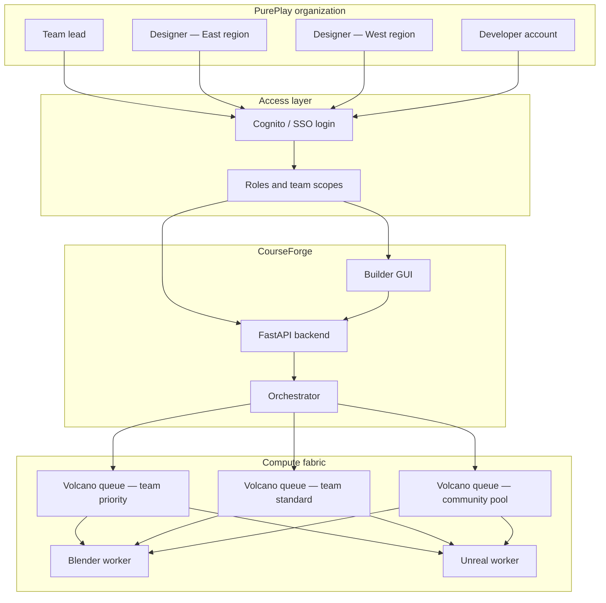
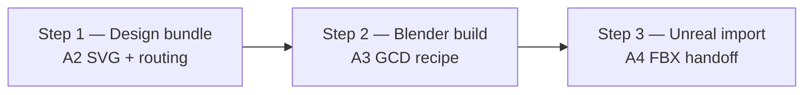
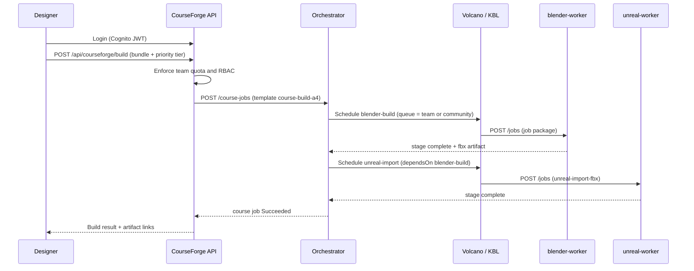

# PurePlay × CourseForge — Multi-Tier Builder Platform Use Case

**Status:** target use case (production vision)  
**Target customer:** **PurePlay**  
**Related:** [Courseforge × KBL integration](courseforge-integration.md) · [ADR 0036](../adr/0036-courseforge-integration-exploration.md)

## Summary

PurePlay course designers use **CourseForge builder tools** to turn design bundles into playable golf courses. Access is gated by **login and team membership**. Compute runs on a shared **Blender + Unreal worker pool** scheduled by the CourseForge orchestrator and, in hosted mode, **KBL + Volcano** for queue-aware batch scheduling.

The platform serves three overlapping audiences:

| Audience | What they need | Service expectation |
|----------|----------------|---------------------|
| **PurePlay design teams** | Reliable builds during working sessions | Predictable turnaround; optional **speed priority** |
| **Developer accounts** | API keys, CI hooks, custom integrations | Tiered quotas; burst or dedicated capacity |
| **Community pool** | Broader access to builder tools for learning and experimentation | **Low SLA** — long queue waits acceptable |

One React GUI and one FastAPI backend ([MILESTONE-A6](https://github.com/courseforge/course-builder/blob/main/milestones/specs/MILESTONE-A6.md)) serve all modes; differences are **identity, tenant policy, and compute queue tier** — not separate products.

---

## Actors and teams

### Team model

| Concept | Meaning for PurePlay |
|---------|---------------------|
| **Organization tenant** | `PurePlay` — top-level billing, data segregation, org-wide policy |
| **Design team** | e.g. `pureplay-east`, `pureplay-prototype` — shared artifact prefix, shared quota pool |
| **Team lead** | Manages members, approves community publication, can purchase priority credits |
| **Designer** | Submits builds, views team artifacts; cannot cross team boundaries |
| **Developer account** | Machine identity (API key / OAuth client) for automation; separate quota and SLA tier |

Team membership is enforced at the API ([MILESTONE-15](https://github.com/courseforge/course-builder/blob/main/milestones/specs/MILESTONE-15.md) tenancy model): every job, artifact URI, and orchestrator `courseId` carries a **tenant id** and **team id** partition key.

---

## Login and access to builder tools

Hosted PurePlay deployments use **Cognito User Pool JWTs** (default reference in M15):

| Claim / field | Use |
|---------------|-----|
| `sub` | Stable user id |
| `custom:tenant_id` | PurePlay org partition |
| `custom:team_id` | Design team for RBAC and artifact paths |
| `cognito:groups` | Roles: `designer`, `team-lead`, `developer`, `community` |
| Scopes | API actions: `build:submit`, `build:read`, `artifact:download`, `dev:webhook` |

**Login surfaces:**

1. **Browser (hosted cloud / community Kind)** — Cognito hosted UI → CourseForge SPA.
2. **Pro desktop (optional)** — Tauri shell with CF1/CFS1 license gate for offline-capable local Blender; same API contract when online.
3. **Developer accounts** — Client-credentials or long-lived API key mapped to a service principal with explicit tier and rate limits.

Authorization **fails closed** when tenant or team claims are missing. Community users receive the `community` group only; they cannot read PurePlay team artifacts.

---

## Service tiers and SLA

PurePlay offers **different levels of service** on the same worker images. KBL **Volcano queues** (or orchestrator priority fields that map to them) implement the split.

| Tier | Who | Target turnaround | Queue behavior | SLA posture |
|------|-----|-------------------|----------------|-------------|
| **Community pool** | Public / invited community designers | Hours to overnight | Lowest `weight`, no preemption, shared cap | **Best-effort** — long waits acceptable; no uptime guarantee on results |
| **Team standard** | PurePlay designers (default) | Typical < 30 min in business hours | Per-team queue, fair share across members | Business-hours support; retry on worker failure |
| **Team priority** | Teams that opt in to speed | Typical < 5 min when capacity exists | Higher weight, optional preemption of community jobs | Paid or credit-based; SLA credits if exceeded |
| **Developer pro** | CI, partner integrations, batch tooling | Configurable (burst vs dedicated) | Dedicated queue or guaranteed minimum `capability` | Contractual; webhook on completion; audit log export |

### Community pool — low SLA by design

The **community pool** opens builder tools to a wider audience (students, partner clubs, open beta):

- Jobs may sit in queue **during peak PurePlay production hours** — this is expected.
- No SLA on queue depth or completion time; status UI shows position and estimated range only.
- Artifact retention is shorter (e.g. 7 days vs 90 days for team tiers).
- Community submissions do **not** consume team priority credits.

PurePlay production teams are isolated in **team-* queues** so community load cannot starve paid design work beyond configured fair-share caps.

### Speed priority (team and developer tiers)

Teams and developer accounts may **opt into priority scheduling**:

- Per-submit flag: `priority: standard | expedited`
- Expedited jobs route to `team-{id}-priority` Volcano queue or receive higher `priorityClassName`
- Billing: priority credits, monthly allotment, or pay-per-build
- KBL mechanism: separate `Queue` CR with higher `weight` and optional `preemptable: false` on team jobs ([ADR 0031](../adr/0031-computewheel-volcano-queue.md))

---

## Current course build pipeline (three steps)

Today the Alex / CourseForge automation path is a **three-step design → Blender → Unreal** flow. The orchestrator expresses steps 2–3 as versioned workflow templates in [`courseforge/course-builder`](https://github.com/courseforge/course-builder) (`tools/automation-workers/orchestrator/workflows/`).

| Step | Milestone | Orchestrator stage | Worker | Output |
|------|-----------|-------------------|--------|--------|
| **1. Design bundle** | A2 | *(CourseForge GUI — not an orchestrator stage)* | — | `course.svg`, routing, optional terrain meta |
| **2. Blender build** | A3 | `blender-build` → package `blender-courseforge-build` | `blender-worker` | `course.blend`, `course.fbx` |
| **3. Unreal import** | A4 | `unreal-import` → package `unreal-import-fbx` | `unreal-worker` | Unreal assets under project path |

**Workflow templates today:**

- [`course-build-a3.yaml`](https://github.com/courseforge/course-builder/blob/main/tools/automation-workers/orchestrator/workflows/course-build-a3.yaml) — Blender only (single stage).
- [`course-build-a4.yaml`](https://github.com/courseforge/course-builder/blob/main/tools/automation-workers/orchestrator/workflows/course-build-a4.yaml) — Blender then Unreal with `dependsOn` and `inputFrom` FBX handoff.

The GUI and API treat the full path as one **“Build course”** action; designers see three logical phases in progress UI even when only two orchestrator stages run.

### Alex — planned Unreal expansion

Alex owns the GCD Blender add-on and Unreal tooling. **Additional Unreal stages** are planned after the initial FBX import slice (A4):

| Future stage (draft) | Purpose | Notes |
|---------------------|---------|-------|
| Landscape from heightmap | Terrain from A1 sidecars | `landscape_from_heightmap.py` scoped in A4 spec |
| Game logic placement | Tees, pins, hazards in-level | A5 hook; data plumbing in A4 |
| Packaging / cook | Playable build artifact | New job packages on stable `unreal-worker` image |

New stages append to the orchestrator DAG as **separate job packages** — heavy Unreal images are not rebuilt per workflow change ([stable worker spec](https://github.com/courseforge/infrastructure/blob/kind/courseforge-suite-2026-05/docs/stable-worker-job-package-pattern/stable-worker-spec.md)).

When KBL backs the pool, each stage may map to a **DominoChain** step with Volcano scheduling and snapshot handoff between Blender and Unreal dominos ([integration options](courseforge-integration.md#integration-options-in-increasing-invasiveness)).

---

## End-to-end request flow (hosted PurePlay)

**Developer account flow** is identical except authentication uses API key / client credentials, and jobs may specify `webhookUrl` for CI completion.

---

## Mapping tiers to KBL constructs

| Platform concept | KBL / Kubernetes artifact |
|------------------|---------------------------|
| Community pool | Volcano `Queue/community-pool` — low weight, large `capability` cap |
| Team standard | Volcano `Queue/team-{teamId}` |
| Team priority | Volcano `Queue/team-{teamId}-priority` or higher priority class |
| Developer pro | Dedicated `PluggableUniverse` or minimum guaranteed queue capability |
| Blender stage | `DominoChain` step → `blender-worker` `runnerImage` |
| Unreal stage | `DominoChain` step → `unreal-worker` `runnerImage` |
| Module release windows | Optional `ComputeWheel` time slice per PurePlay product line |
| Audit / regrade | Snapshot IDs + replay log per build |

See [Courseforge × KBL integration](courseforge-integration.md) for adapter and shim options between orchestrator HTTP dispatch and Workflow / DominoChain CRs.

---

## PurePlay deployment modes

| Mode | Shell | Compute | Typical tier |
|------|-------|---------|--------------|
| **Hosted cloud (EKS)** | Browser + Cognito | Orchestrator + KBL + Volcano on EKS | All tiers including community pool |
| **Community Kind** | Browser on lab ingress | Same stack at smaller scale | Community + team dev |
| **Pro desktop** | Tauri + local license | Local Blender; cloud optional for Unreal | Team standard locally; cloud for UE |
| **Developer CI** | API only | Webhook-driven orchestrator jobs | Developer pro |

PurePlay production is expected to run **hosted cloud** for team and community tiers, with **home i9 / Kind lab** ([lab/HOME-LAB.md](../../lab/HOME-LAB.md)) for integration testing before EKS rollout.

---

## Open decisions

1. **Priority pricing** — credits per expedited build vs monthly team allotment.
2. **Community eligibility** — open signup vs invite-only vs PurePlay-branded subdomain.
3. **Cross-team sharing** — whether a finished course can be published from team A to community without re-build.
4. **GPU queue** — separate Volcano queue for GPU-heavy Unreal cooks when Alex adds them (i9 `kbl.io/gpu=present` label).
5. **KBL adapter timing** — orchestrator-native queues first vs full DominoChain mapping in Phase 32.

---

## References

- [courseforge-integration.md](courseforge-integration.md) — KBL scheduler behind CourseForge workers
- [ADR 0036: Courseforge integration exploration](../adr/0036-courseforge-integration-exploration.md)
- [ADR 0031: ComputeWheel Volcano queue](../adr/0031-computewheel-volcano-queue.md)
- CourseForge [MILESTONE-A3](https://github.com/courseforge/course-builder/blob/main/milestones/specs/MILESTONE-A3.md) (Blender / GCD)
- CourseForge [MILESTONE-A4](https://github.com/courseforge/course-builder/blob/main/milestones/specs/MILESTONE-A4.md) (Unreal import)
- CourseForge [MILESTONE-A6](https://github.com/courseforge/course-builder/blob/main/milestones/specs/MILESTONE-A6.md) (multi-mode distribution)
- CourseForge [MILESTONE-15](https://github.com/courseforge/course-builder/blob/main/milestones/specs/MILESTONE-15.md) (hosted auth, tenancy, quotas)
- [Stable worker job package pattern](https://github.com/courseforge/infrastructure/blob/kind/courseforge-suite-2026-05/docs/stable-worker-job-package-pattern/stable-worker-spec.md)
