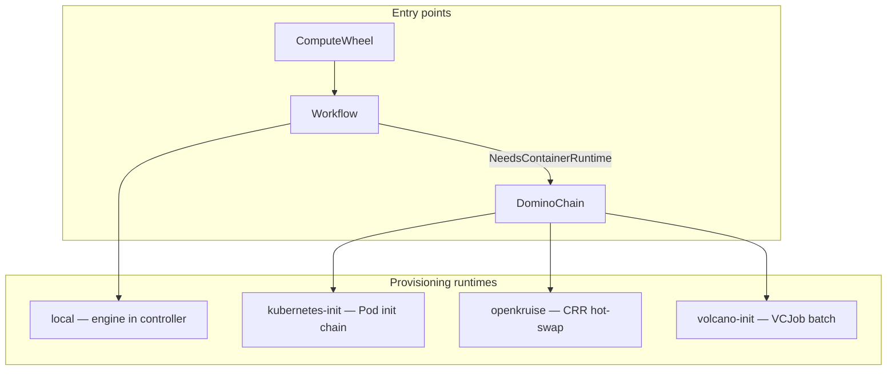

# Provisioning Runtimes

How KBL executes domino chains in-cluster. Each runtime is selected via `DominoChain.spec.runtime` or `Workflow.spec.execution.runtime`.

## Overview



## Runtime comparison

| | `local` | `kubernetes-init` | `openkruise` | `volcano-init` |
|---|---------|-------------------|--------------|----------------|
| **K8s objects** | None (in-process) | Pod + init containers | Pod + CRR per step | Volcano Job + init containers |
| **Scheduler** | N/A | default-scheduler | default-scheduler | Volcano |
| **Handoff** | In-memory / store | emptyDir `/kbl/handoff` | emptyDir `/kbl/handoff` | emptyDir `/kbl/handoff` |
| **Step execution** | Sequential in engine | Sequential init containers | One slot hot-swapped at a time | Sequential init containers in VCJob task |
| **Dependencies** | None | Standard K8s | OpenKruise CRD | Volcano CRD |
| **Blog mapping** | CLI / dev path | Standard domino chain | Player-piano hot-swap | SyncSet / batch provisioning |
| **ADR** | MVP | [0007](adr/0007-hot-swapped-dominos-implementation.md) | [0007](adr/0007-hot-swapped-dominos-implementation.md) | [0030](adr/0030-controller-volcano-emission.md) |

## `local`

Default when `spec.execution.runtime` is empty or `local`. The workflow reconciler runs `engine.Run()` in-process. No Pods created.

**Use for:** CLI, unit tests, `finance-lab` workflow in Kind.

```yaml
spec:
  execution:
    runtime: local
    chain: [load, transform]
```

## `kubernetes-init`

DominoChain reconciler creates a Pod whose **init containers** run steps sequentially. A pause container keeps the Pod alive after inits complete. Snapshot data comes from a ConfigMap volume.

**Use for:** Any Kubernetes cluster without extra schedulers.

```yaml
apiVersion: kbl.io/v1alpha1
kind: DominoChain
spec:
  runtime: kubernetes-init
  runnerImage: kbl-domino-runner-julia:lab
  steps:
    - { name: load, command: julia:identity }
    - { name: interp, command: julia:interpolate }
```

Example: [examples/julia-domino-chain/dominochain-init.yaml](../examples/julia-domino-chain/dominochain-init.yaml).

### Environment (all container runtimes)

| Variable | Purpose |
|----------|---------|
| `KBL_COMMAND` | Domino command (e.g. `julia:greeks`) |
| `KBL_INPUT` | Input JSON path |
| `KBL_OUTPUT` | Output JSON path |
| `KBL_JULIA_PROJECT` | Set automatically for `julia:*` commands |

## `openkruise`

Placeholder Pod with one pause container per step slot. The reconciler issues **ContainerRecreateRequest** (CRR) resources to hot-swap each slot with the real domino-runner image, one step at a time.

**Use for:** Player-piano scheduling, minimizing cold-start between steps on long chains.

**Requires:** OpenKruise installed (`lab/scripts/install-openkruise.sh`).

```yaml
spec:
  runtime: openkruise
  nodeSelector:
    kbl.io/lab-role: compute
  steps:
    - { name: load, command: julia:identity }
```

Lab demo: `DominoChain/julia-finance-openkruise` (applied by `make lab-up`).

Flow:

```
Pod (placeholders) → CRR slot-0 → step completes → CRR slot-1 → … → Completed
```

## `volcano-init`

DominoChain reconciler creates a **Volcano Job** (`batch.volcano.sh/v1alpha1`) with a single task whose pod template mirrors the init-chain layout. Volcano handles queueing and gang scheduling.

**Use for:** Batch workloads, queue fairness, blog SyncSet semantics.

**Requires:** Volcano installed (`lab/scripts/install-volcano.sh`).

```yaml
spec:
  runtime: volcano-init
  volcanoQueue: kbl-lab
  nodeSelector:
    kbl.io/lab-role: compute
  steps:
    - { name: load, command: julia:identity }
```

Optional fields:

| Field | Default | Purpose |
|-------|---------|---------|
| `volcanoQueue` | `default` | Volcano queue name |
| `nodeSelector` | none | Pin task pods to nodes |
| `runnerImage` | domino-runner default | Julia: `kbl-domino-runner-julia:lab` |

### ComputeWheel + Volcano (Phase 27)

ComputeWheel stamps child Workflows with `execution.runtime: volcano-init` and `volcanoQueue` from wheel spec or template:

```yaml
apiVersion: kbl.io/v1alpha1
kind: ComputeWheel
spec:
  volcanoQueue: kbl-lab
  workflowTemplate:
    execution:
      runtime: volcano-init
      chain: [load, interp, greeks]
```

Pipeline: **ComputeWheel → Workflow → DominoChain → VCJob**.

Example: [examples/compute-wheel/wheel-volcano.yaml](../examples/compute-wheel/wheel-volcano.yaml).

## Workflow → DominoChain bridge

When `Workflow.spec.execution.runtime` is not `local`, the workflow reconciler creates a child `DominoChain` named `{workflow}-dchain` and polls until complete.

`NeedsContainerRuntime` is true when:

- `runtime` is set and not `local`, or
- any domino specifies a container `image`

Provisioning fields propagate to DominoChain:

| Workflow field | DominoChain field |
|----------------|-------------------|
| `execution.runtime` | `spec.runtime` |
| `execution.volcanoQueue` | `spec.volcanoQueue` |
| `provisioning.runnerImage` | `spec.runnerImage` |
| `provisioning.nodeSelector` | `spec.nodeSelector` |

## Kind lab matrix

| Demo | Runtime | Install flag |
|------|---------|--------------|
| `finance-lab` | local | always |
| `julia-finance-wheel` | volcano-init | `KBL_LAB_VOLCANO=1` (default) |
| `julia-finance-openkruise` | openkruise | `KBL_LAB_OPENKURISE=1` (default) |

See [getting-started.md](getting-started.md) and [lab/README.md](../lab/README.md).

## References

- [ADR 0007 — Hot-Swapped Dominos Implementation](adr/0007-hot-swapped-dominos-implementation.md)
- [ADR 0029 — Volcano Kind Lab](adr/0029-volcano-kind-lab.md)
- [ADR 0030 — Controller Volcano Emission](adr/0030-controller-volcano-emission.md)
- [ADR 0031 — ComputeWheel Volcano Queue](adr/0031-computewheel-volcano-queue.md)
- [ADR 0032 — OpenKruise Kind Lab](adr/0032-openkruise-kind-lab.md)
